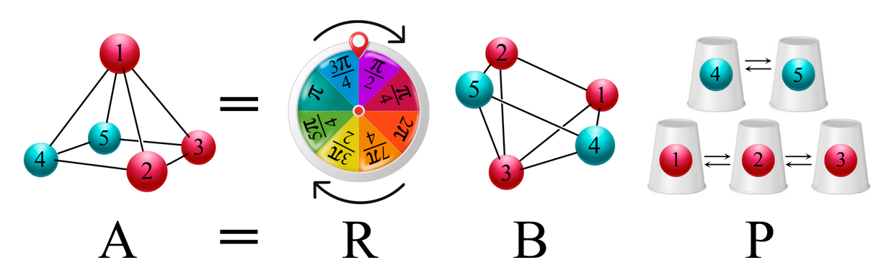

molalign
========

**molalign** is a fortran program based on random rotations and the Hungarian algorithm to solve the approximate congruence problem for atomic systems.

Building
--------

Run `./build.sh` without arguments to build the program in double
precision with all optimizations enabled. The script accepts the
following options to change the default behaviour:

-q: Recompile only modified source files.  
-d: Compile non optimized code with debug info.  
-r single|double: Set the real precision to single or double (default).  
-l static|shared|python: Build the selected library instead of the program.  

After runnig the script the program will be created in the *bin* directory and the libraries in the *lib* directory.

Usage
-----

### Program options

-live: Print live stats.  
-iter: Use iterative steps.  
-mass: Use mass weighted distances.  
-stdin: Read coordinates from standard input.  
-out xyz|mol2: Set output format to XYZ or Mol2.  
-test: Use the same pseudo random numbers on every run.  
-rec *NUM*: Set the number of recorded solutions to *NUM*.  
-count *NUM*: Set count convergence threshold to *NUM*.  
-trial *MAX*: Set maximum number of trials to *MAX*.  
-bias *TOL*: Use biasing with tolerance *TOL*.  
-scale *SCALE*: Set length scale to *SCALE*.  
 
### Examples

Te following command will run the program with
up to 10 recorded mappings,
a convergence threshold of 10 counts,
a maximum of 1000 trials,
biasing with a tolerance of 0.17 Å,
iteration,
mass weighted distances
and repeatable pseudo random numbers:

    ./bin/molalign tests/r005/Co100.xyz -rec 10 -count 10 -max 1000 -bias 0.17 -iter -mass -test
 
The ouput should look as follows:

     Map   Trial   Count   Cycles   Meanrot   Totalrot      RMSD
    ------------------------------------------------------------
       1       2      10      2.0      65.2     116.0     0.0482
       2       1       4      1.5      78.0     110.0     2.1060
    ------------------------------------------------------------
    Found 2 mapping(s) in 14 random trial(s)
